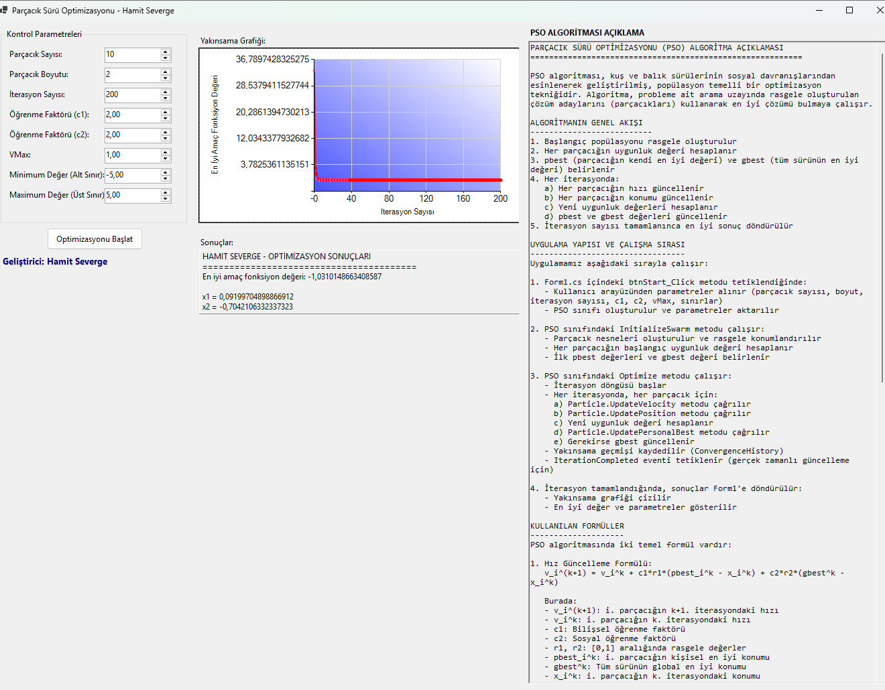

# PSO Algorithm - Particle Swarm Optimization

## Açıklama
PSO (Particle Swarm Optimization) algoritmasının C# implementasyonu ile matematiksel optimizasyon problemlerini çözen masaüstü uygulaması. Kuş sürülerinin doğal davranışından esinlenen Swarm Intelligence tabanlı yapay zeka tekniği kullanır.

## Özellikler
- **3 Test Fonksiyonu:** Six-hump Camel Back, Sphere, Rosenbrock
- **Gerçek Zamanlı Görselleştirme:** Algoritma yakınsamasını canlı grafik ile takip
- **Parametrik Kontrol:** Parçacık sayısı, boyut, iterasyon, katsayılar ayarlanabilir
- **Responsive UI:** Thread-safe operasyonlarla donmayan arayüz

## Teknolojiler
- C# .NET 8.0
- Windows Forms
- Mathematical Algorithms
- Data Visualization

## Yapay Zeka Kullanımı
Bu projede **Swarm Intelligence** (Sürü Zekası) tabanlı yapay zeka kullanılmıştır. PSO algoritması, her parçacığın kendi deneyiminden öğrenmesi (bilişsel öğrenme) ve sürüdeki diğer parçacıkların başarılarından faydalanması (sosyal öğrenme) prensiplerine dayanır.

## Kurulum ve Çalıştırma
1. Repository'yi clone edin
2. Visual Studio ile açın
3. Build ve Run yapın

## Kullanım Alanları
Mühendislik optimizasyonu, yapay zeka, finans modellemesi, araştırma geliştirme projelerinde kullanılabilir.
